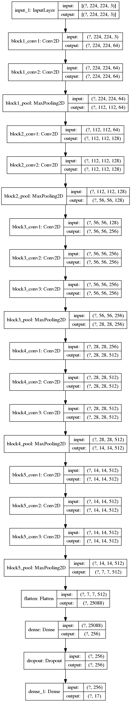

[Flowers 17 dataset]:
http://www.robots.ox.ac.uk/~vgg/data/flowers/17/

## Transfer Learning

Example project of using VGG-16 as a pretrained network and applying transfer learning via fine tuning for the [Flowers 17 dataset].

The aim is to build a classifier using transfer learning to be able to classify each flower image into its repsective species.

The project also aims to showcase my existing knowledge and experience of building and running an ML project end-to-end

### Dataset

The flowers-17 dataset comprise of 17 categories of flowers species, with 80 images per category, a total of 1360 images.

Each image in a category have varying dimensions and orientation ( mix of landscape and potrait ).

### Data preprocessing

For this specific task, since we are using VGG 16 which takes an input of 224x244, we will be resizing the image to the same dimension while preserving aspect ratio

We also normalize the RGB values by dividing it with 255.0 so its in the range of [0,1]

Since this is a small dataset, to combat overfitting, we apply image augmentation by applying transformations to the image during training.

### Model Architecture

The new model architecture is shown below:



The base model is a pre-trained VGG16 model.

The FC / fully-connected layers are removed and replaced with our custom FC layers of the following:

```
FLATTEN => DENSE (256) => RELU => DROPOUT => DENSE (17) => SOFTMAX
```


### Evaluation

Results after initial warm up phase:
```
[INFO] Evaluation after warm up...
              precision    recall  f1-score   support

    bluebell       0.59      0.87      0.70        15
   buttercup       0.96      0.96      0.96        23
   coltsfoot       0.83      1.00      0.91        20
     cowslip       0.75      0.65      0.70        23
      crocus       0.77      0.85      0.81        20
    daffodil       1.00      0.76      0.86        21
       daisy       1.00      0.95      0.97        20
   dandelion       1.00      0.77      0.87        22
  fritillary       0.95      1.00      0.97        18
        iris       0.95      0.95      0.95        20
  lilyvalley       0.96      0.81      0.88        27
       pansy       1.00      1.00      1.00        23
    snowdrop       0.76      1.00      0.86        16
   sunflower       1.00      1.00      1.00        19
   tigerlily       1.00      0.94      0.97        18
       tulip       0.73      0.84      0.78        19
  windflower       1.00      0.81      0.90        16

    accuracy                           0.89       340
   macro avg       0.90      0.89      0.89       340
weighted avg       0.90      0.89      0.89       340

```

Results after fine tuning:
```
[INFO] Evaluation after fine tuning...
              precision    recall  f1-score   support

    bluebell       1.00      1.00      1.00        15
   buttercup       0.96      1.00      0.98        23
   coltsfoot       0.95      1.00      0.98        20
     cowslip       0.86      0.83      0.84        23
      crocus       1.00      0.85      0.92        20
    daffodil       1.00      0.95      0.98        21
       daisy       1.00      0.95      0.97        20
   dandelion       1.00      0.91      0.95        22
  fritillary       1.00      1.00      1.00        18
        iris       1.00      0.95      0.97        20
  lilyvalley       0.93      0.96      0.95        27
       pansy       1.00      1.00      1.00        23
    snowdrop       0.89      1.00      0.94        16
   sunflower       1.00      1.00      1.00        19
   tigerlily       0.90      1.00      0.95        18
       tulip       0.79      0.79      0.79        19
  windflower       0.89      1.00      0.94        16

    accuracy                           0.95       340
   macro avg       0.95      0.95      0.95       340
weighted avg       0.95      0.95      0.95       340

```

The initial warm-up phase indicated that the new model head is randomly initialized and still trying to learn the salient features from the underlying base model. This accounts for the lower F1 scores for certain categories such as bluebell and cowslip. The training and validation loss are also much higher at `0.7636` and `0.4146` at the end of the first 25 epochs.

During fine-tuning, the train and validation loss values start to fall, converging from epoch 50 onwards with train loss at `0.2880` and val loss at `0.2221`.

The model converges at epoch 100 with train loss at `0.1883` and validation loss at `0.1886`. The final training accuracy is `0.9403` and validation accuracy at `0.95`

This is further confirmed by the second classification report. The overall F1 score for each category has improved, increasing the overall accuracy to `0.95`

### Extensions

We can experiment further to improve the accuracy of the model by making earlier CONV blocks in the base VGG16 model trainable or "unfreezing" it during the fine tuning process.

Additional image augmentation can also be applied during the training process.


### Deployment

We can test the deployment of the trained model locally by using the tensorflow serving docker image.

To deploy and test the model locally we utilize the Tensorflow Serving Framework through a docker container and mount the built model directory:

```
docker run -it --rm -p 8500:8500  \
    -v "$PWD/flowers17:/models/flowers17" \
    -e MODEL_NAME=flowers17 \
    tensorflow/serving
```

The above launches a TF Server at 8500 running the grpc protocol. To utilize the JSON API, we need to bind port 8501.

A GRPC request needs to be built with the input image in order to send to the server. This is shown in `predict.py` where we accept an input image path; load the image by rescaling it to `224x224` in order to fit the VGG model input shape; convert it into an array and apply imagenet specific preprocessing since VGG16 is trained on imagenet...

Next we construct a `PredictRequest` object. The `model_spec.name` and `model_spec.signature_name` can be determined by running `saved_model_cli` on the saved model:
```
saved_model_cli show --dir flowers17/0001/ --all

2020-11-26 14:56:50.914140: I tensorflow/stream_executor/platform/default/dso_loader.cc:48] Successfully opened dynamic library libcudart.so.10.1

MetaGraphDef with tag-set: 'serve' contains the following SignatureDefs:

signature_def['__saved_model_init_op']:
  The given SavedModel SignatureDef contains the following input(s):
  The given SavedModel SignatureDef contains the following output(s):
    outputs['__saved_model_init_op'] tensor_info:
        dtype: DT_INVALID
        shape: unknown_rank
        name: NoOp
  Method name is: 

signature_def['serving_default']:
  The given SavedModel SignatureDef contains the following input(s):
    inputs['input_1'] tensor_info:
        dtype: DT_FLOAT
        shape: (-1, 224, 224, 3)
        name: serving_default_input_1:0
  The given SavedModel SignatureDef contains the following output(s):
    outputs['dense_1'] tensor_info:
        dtype: DT_FLOAT
        shape: (-1, 17)
        name: StatefulPartitionedCall:0
  Method name is: tensorflow/serving/predict

  ....
```

From above output, we can see that the input name is `input_1` and the output name is `dense_1`.

To make a prediction, we run `predict.py` with an input image path. An example of a sunflower prediction is shown below:

```
python predict.py -i datasets/images/sunflower/image_0734.jpg
```

```
[INFO] Raw Prediction Labels: [0.0, 0.0, 0.0, 0.0, 0.0, 0.0, 0.0, 0.0, 0.0, 0.0, 0.0, 0.0, 0.0, 1.0, 0.0, 0.0, 0.0]
[INFO] Predicted Label: sunflower

```

### Extensions

Further extension to the deployment process include:

* Deploying the model into the cloud such as AWS ECS
	
	The trained model can be uploaded into an S3 bucket which can be fetched from the TFX container running in ECS

	The difficulty here is that the TFX container is serving the GRPC protocol, which means we need an Application Load Balancer that understands GRPC or run an application server such as nginx as a sidecar with TFX...

* Deploying the model into Lambda function
  
  Package the model artifacts and prediction code into a package which can be uploaded and run as a Lambda function...

  This may prove tricky as we also need to package the tensorflow libs which are large in size and lambda has a limit of 512 MB in its /tmp storage space...


### References

[Flowers 17 dataset]